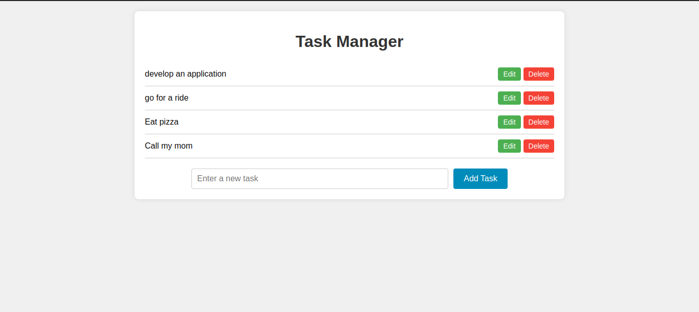
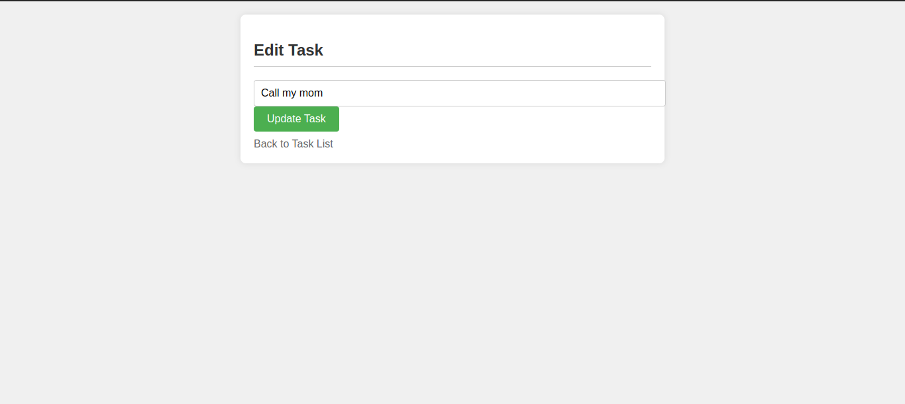

# Task Manager

Task Manager is a simple web application that allows you to manage your tasks. You can add new tasks, edit existing tasks, and delete tasks as needed.

## Screenshots

### Task List
<p align="center">
  
</p>


### Edit Task
<p align="center">
  
</p>

## Features

- View a list of tasks.
- Add a new task.
- Edit existing tasks.
- Delete tasks.

## Technologies Used

- HTML
- CSS

## Usage

1. Clone the repository:

```bash
git clone https://github.com/Francis-Mwaniki/hapi-task-manager.git
```

<!-- hapi-task-manager -->

2. Navigate to the project directory.

3. Open `index.html` in your web browser.

4. Use the interface to manage your tasks:
- **Add Task**: Enter a task in the input field and click "Add Task".
- **Edit Task**: Click on "Edit" next to a task to update its details.
- **Delete Task**: Click on "Delete" next to a task to remove it from the list.

## Contributing

Pull requests are welcome. For major changes, please open an issue first to discuss what you would like to change.

## License

This project is licensed under the MIT License - see the [LICENSE](LICENSE) file for details.
